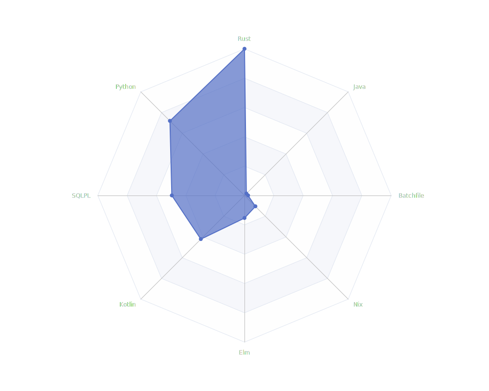

# dev-radars
Render a radar plot of your tech stack and print LOC statistics. `dev-radars` parses git objects to compute statistics per technology.



`dev-radars` is something between running [Aloc](https://github.com/AlDanial/cloc/tree/master) in a Docker container and executing random commands from the internet:

```
git ls-files | xargs -n1 git blame --line-porcelain | sed -n 's/^author //p' | sort -f | uniq -ic | sort -nr
```

## Installation

Using cargo:

```
git clone --recursive git@github.com:Manuel030/dev-radars.git
cargo install --path dev-radars
```

## Usage
```
Usage: dev-radars [OPTIONS]

Options:
  -p, --path <PATH>         Which path to search
  -d, --depth <DEPTH>       Depth of child directories to traverse
  -a, --author <AUTHOR>...  
  -t, --top-n <TOP_N>       [default: 10]
  -h, --help                Print help
  -V, --version             Print version
```

## Examples

Parse a directory only up to a depth of 2

```
dev-radars -p /home/manuel/projects -d 2
```

When collecting the LOC, search for both author names `foo` and `bar`

```
dev-radars -p /home/manuel/projects -a "foo" "bar"
```

## Todos
- [ ] Flag to add an ignore list of directory names
- [ ] Parallel processing
- [ ] Installation with Nix
- [X] Support multiple user names (local and global)
- [ ] Add progress bar

